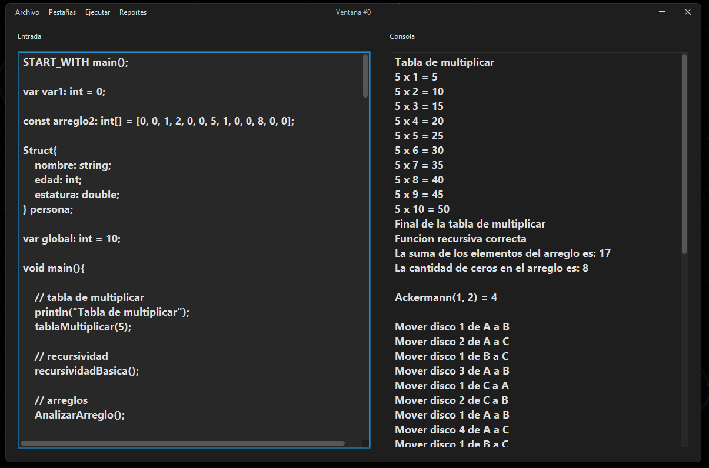

# 
 **JavaCraft**

JavaCraft is a project to develop an interpreted programming language and its corresponding integrated development environment (IDE). The purpose of the project is to provide an educational tool for lexical, syntactic, and semantic analysis, facilitating the teaching and learning of compiler concepts and programming languages.

 

## 
 Main Features

### 
 Code Editor:
Allows creation, opening, and editing of .jc source files.

### 
 Code Execution:
Implements an interpreter that performs lexical, syntactic, and semantic analysis, and executes JavaCraft language statements.

### 
 Reports:
Generates error reports, the Abstract Syntax Tree (AST), and the symbol table.

### 
Console Area:
Displays program results, messages, and any output.

### 
 Graphical Interface:

    

### 
 Keyboard Shortcuts

    Ctrl + U: New File
    Ctrl + N: Open File
    Ctrl + S: Save File
    Ctrl + +: New Tab
    Ctrl + -: Close Current Tab
    Ctrl + R: Run
    Ctrl + E: Error Report
    Ctrl + W: AST Report
    Ctrl + Q: Symbol Table Report

 

## 
  Language Features

### 
 Case Insensitive:
The language is not case-sensitive.

### 
 Comments:
Supports single-line (//) and multi-line (/* */) comments.

### 
 Data Types:
Strongly typed and statically typed, with support for various arithmetic and logical operations.

### 
 Flow Control:
Implements if, while, for, do-while statements, and transfer statements such as break and continue.

### 📌 Grammar File:
[Grammar.txt](Documentacion/Gramatica.txt)

 

# 
 **JavaCraft**

JavaCraft es un proyecto de desarrollo de un lenguaje de programación interpretado y su correspondiente entorno de desarrollo integrado (IDE). El propósito del proyecto es proporcionar una herramienta educativa para el análisis léxico, sintáctico y semántico, facilitando la enseñanza y el aprendizaje de conceptos de compiladores y lenguajes de programación.

 

## 
 Funcionalidades Principales

### 
 Editor de Código: 
Permite la creación, apertura y edición de archivos fuente .jc.

### 
 Ejecución de Código: 
Implementa un intérprete que realiza análisis léxico, sintáctico y semántico, y ejecuta las sentencias del lenguaje JavaCraft.

### 
 Reportes: 
Genera reportes de errores, el AST (árbol de sintaxis abstracta) y la tabla de símbolos.

### 
 Área de Consola:
Muestra resultados, mensajes y cualquier output del programa.

### 
 Interfaz gráfica:

    

### 
 **Atajos de Teclado**

    Ctrl + U: Nuevo Archivo
    Ctrl + N: Abrir Archivo
    Ctrl + S: Guardar Archivo
    Ctrl + +: Nueva Pestaña
    Ctrl + -: Cerrar Pestaña actual
    Ctrl + R: Iniciar
    Ctrl + E: Reporte de Errores
    Ctrl + W: Reporte AST
    Ctrl + Q: Reporte de Tabla de Simbolos

 

## 
 Características del Lenguaje

### 
 Case Insensitive: 
El lenguaje no distingue entre mayúsculas y minúsculas.

### 
 Comentarios: 
Soporte para comentarios de una línea (//) y multilínea (/* */).

### 
 Tipos de Dato:
Fuerte tipado y tipado estático, con soporte para varias operaciones aritméticas y lógicas.

### 
 Control de Flujo: 
Implementación de sentencias if, while, for, do-while, y sentencias de transferencia como break y continue.

### 📌 Archivo Gramática:
[Gramatica.txt](Documentacion/Gramatica.txt)